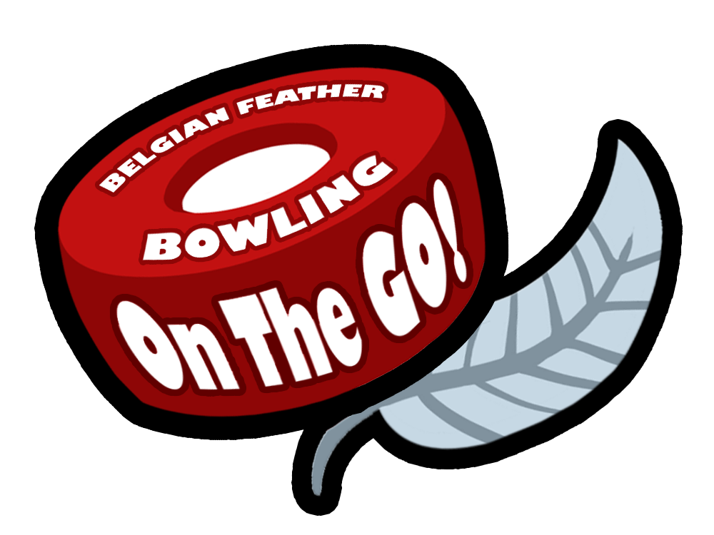
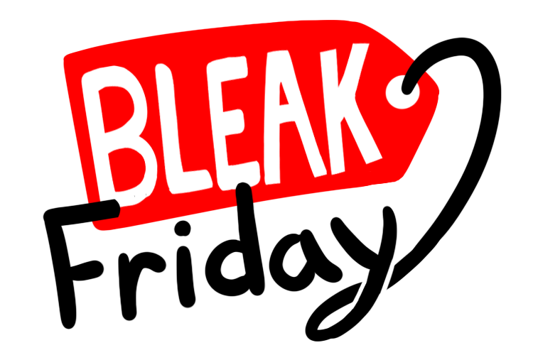
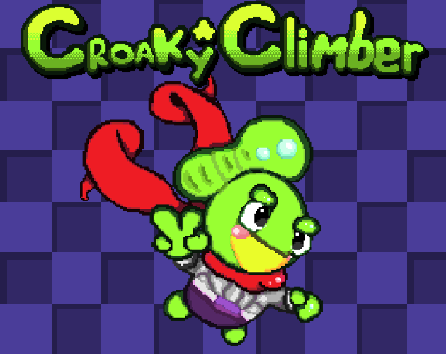
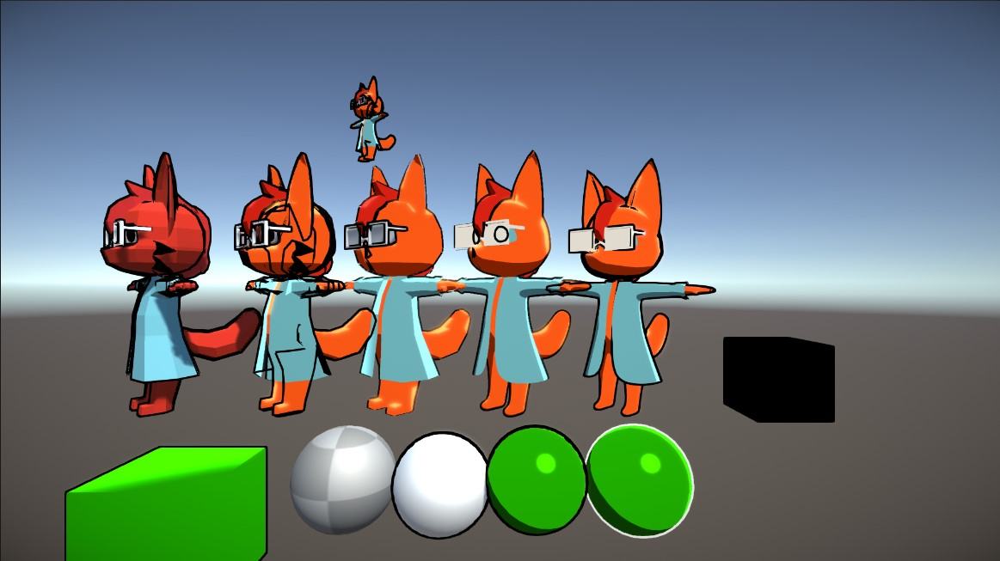

(I'll finish this later 🙄)

# 💙Lover💙 of 🦦Otters🦦 🧪Science🧪 & 😎Shades😎
I don't really internet but here's some of my stuff

## Games

## Grahpics
Gerstner Wave Water Shader

Experiementing with shders in Unity
- Toon Shader
- Outline Shader: Testing both (a naive) inverse hull approach and post processing approach
- Other post processing effects

## (G)Art

<!--- TODO: Use gifs lol

