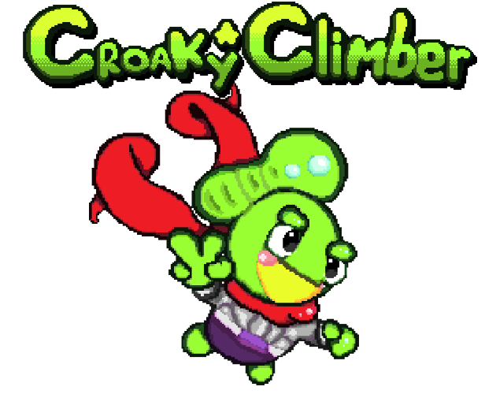

(I'll finish this later 🙄)

# 💙Lover💙 of 🦦Otters🦦 🧪Science🧪 & 😎Shades😎
I don't really internet but here's some of my stuff

## Games

  

## Grahpics

  
Gerstner Wave Water Shader

\- Made with OpenGL / GLSL in own rendering engine  
\- Uses math done by real smart people to be physically accurate  
\- Tons of parameters to mess with  
\- Heightmap of Lake Champlain / Burlington area in there for fun, using real height data from [Tangrams Heightmapper](https://tangrams.github.io/heightmapper/) (so kool!)  
\- Read the [Wikipedia](https://en.wikipedia.org/wiki/Trochoidal_wave) page

 

Experiementing with shders in Unity

\- Toon Shader  
\- Outline Shader: Testing both (a naive) inverse hull approach and post processing approach  
\- Other post processing effects  

 

## (G)Art

3D Arts may or not be uploaded here at some point

<!--- TODO: Use gifs lol

